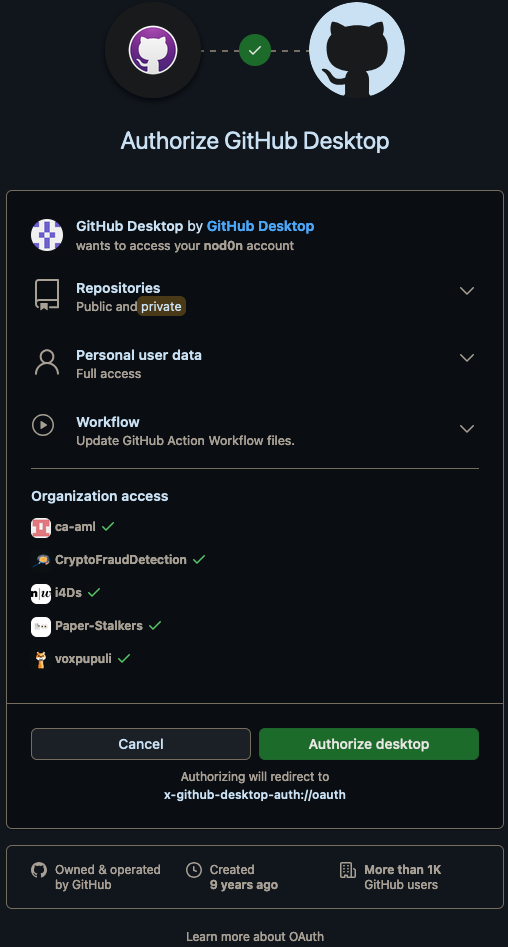
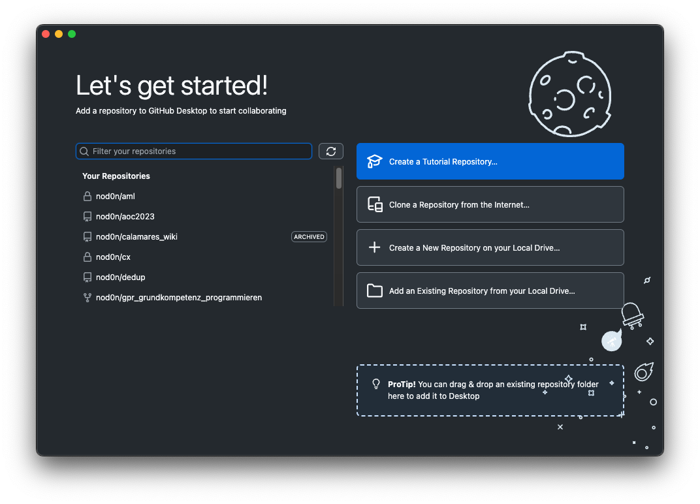
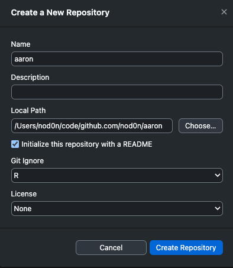
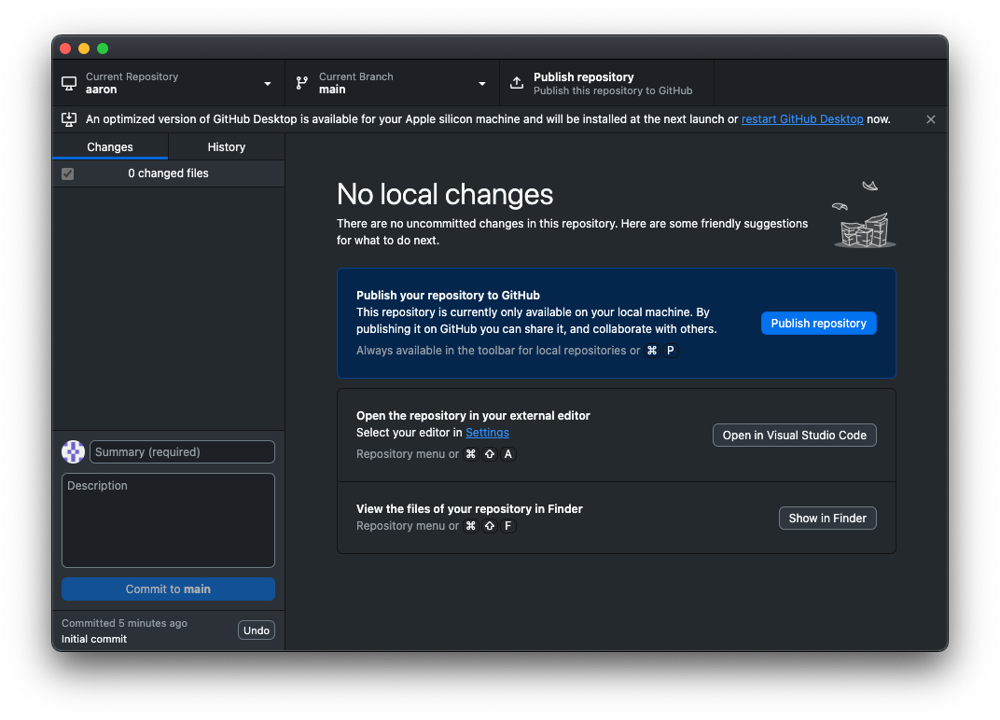
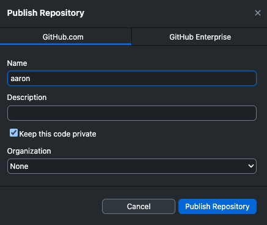
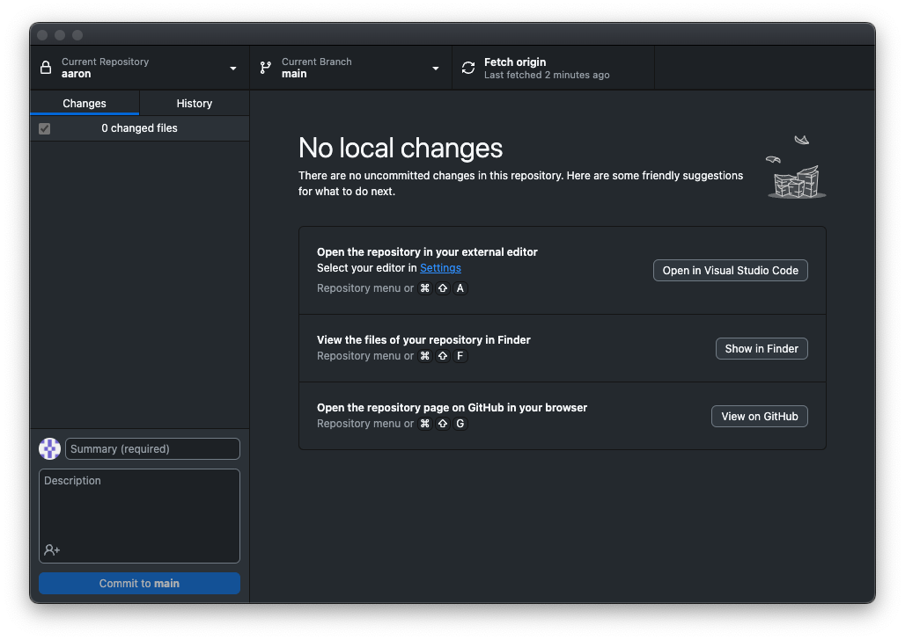

# Git, GitHub, und GitHub Desktop

## Begriffe

- **GitHub**: ist wie Google Drive aber für Code. Es ist ein Ort, an dem Code gespeichert, geteilt, und bearbeitet werden kann.
- **Git**: GitHub verwendet Git im Hintergrund. Git macht die eigentliche Arbeit, GitHub ist die Webseite, die uns die Arbeit erleichtert.
- **GitHub Desktop**: ist ein Tool, mit dem wir Git und GitHub bedienen können.

## GitHub-Konto erstellen

Wichtig: verwendet eure private E-Mail-Adresse und nicht die E-Mail-Adresse der Hochschule, da das Konto sonst bei Verlassen der Hochschule verloren geht! Die Hochschul-E-Mail-Adresse kann später hinzugefügt werden.

Ein GitHub-Konto kann über folgenden Link erstellt werden: [github.com/signup](https://github.com/signup). Es sollte ein starkes Passwort gewählt werden um fremde Zugriffe zu verhindern.

## Installation

1. [Git](https://git-scm.com/download) herunterladen und installieren.
2. [GitHub Desktop](https://desktop.github.com/download/) herunterladen und installieren.

## GitHub Desktop einrichten

Nach der Installation von GitHub Desktop muss das Programm eingerichtet werden.

1. GitHub Desktop öffnen. Wenn GitHub Desktop zum ersten Mal geöffnet wird, erscheint die Willkommensseite:

    

2. Auf `Sign in to GitHub.com` klicken und melde mit dem GitHub-Konto anmelden, das zuvor erstellt wurde.

   1. 
   2. Die Meldung, dass GitHub Desktop autorisiert werden soll, bestätigen.

        

   3. Die Meldung, dass zu GitHub Desktop gewechselt werden soll, bestätigen.

3. Falls gewünscht, kann der Name und die E-Mail-Adresse angepasst werden. Diese werden in gewissen Situationen öffentlich angezeigt:

    

4. GitHub Desktop ist nun eingerichtet und bereit für die Verwendung:

    

## Repository erstellen

Ein Repository ist ein Ordner, in dem Code gespeichert wird. Wird ein Ordner von Git verwaltet, so nennt man ihn ein Repository.

1. In GitHub Desktop auf `File` -> `New Repository` klicken.

    
    

2. Repository auf GitHub "pushen" (hochladen):

    

3. Repository auf GitHub ansehen (`View on GitHub`):

    

4. Banknachbarn zum Repository einladen:

    1. 
    2. 

5. Einladung annehmen (E-Mail):

6. Repo Clonen:
